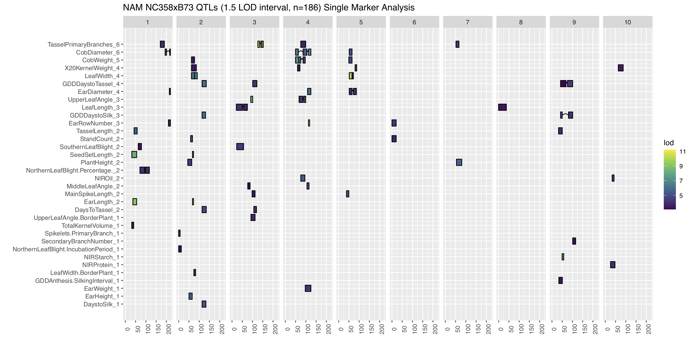
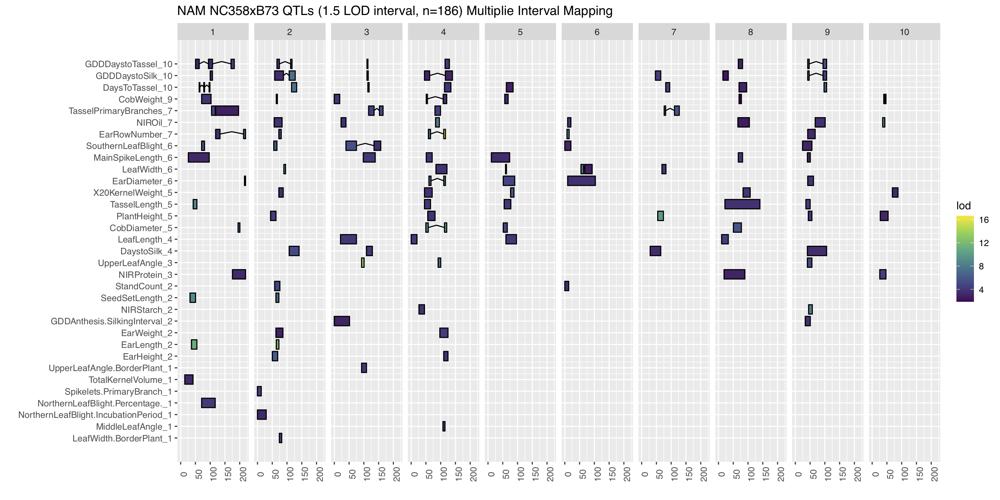
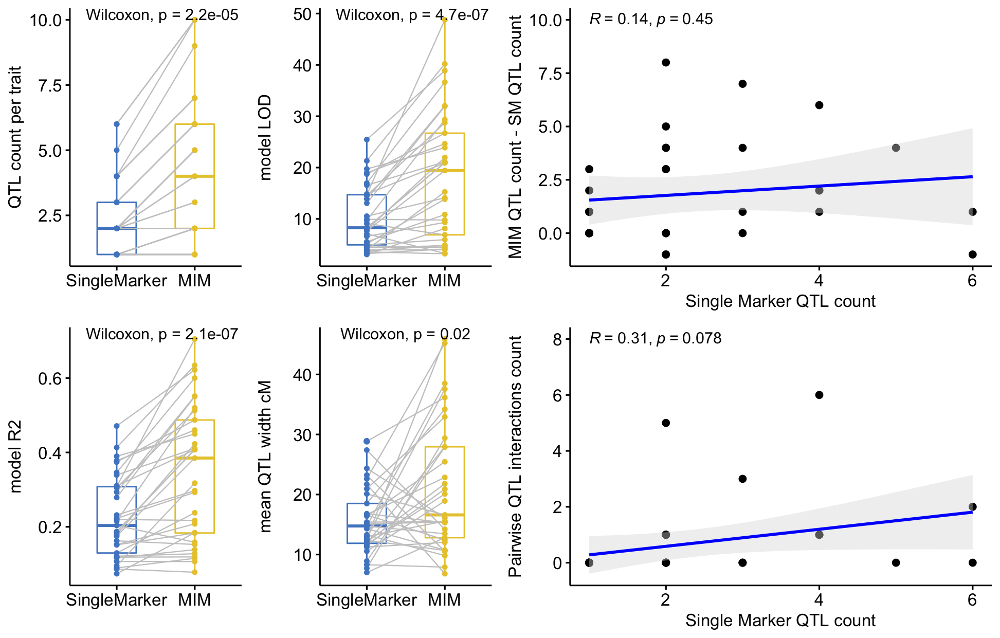
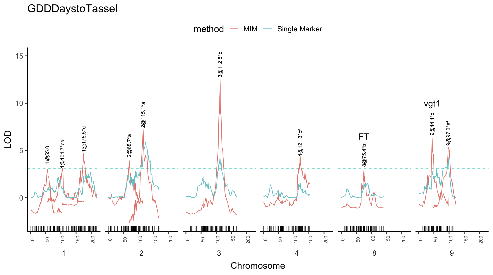
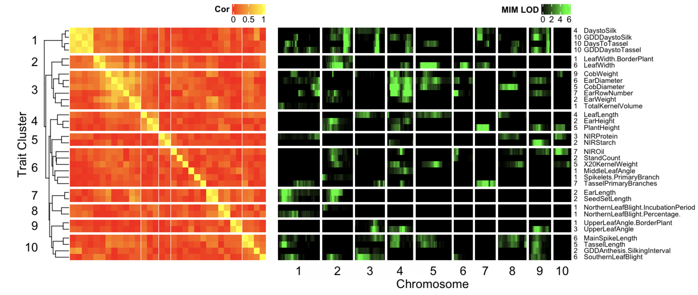

```{r setup, echo=FALSE,  message=FALSE}
library(knitr)    # For knitting document and include_graphics function
library(png)      # For grabbing the dimensions of png files
knitr::opts_chunk$set(echo = TRUE, fig.align="center")
```

## Introduction

For the current assignment I used the data from NAM population 21 derived from the cross B73 x NC358. B73 is a tempearte inbred line and NC358 is an inbred line developed at NCSU by Major Goodman from tropical material selected in North Carolina. F1 seed were advanced by selfing up to the 5th generation and then bulk seed were collected from inter-sibling mating. The resulting 187 RILs, were phenotyped for 58 traits  in up to 8 fields US , including tropical stations in PR and FL. These traits include  biochemical, morphological, phenological and yield phenotypes, as well as resistance against two diseases. The acompaniyng genetic map conists of 1106 markers with an average distance of one marker every 1.3 Mb. Most of the traits phenotyped for this population vary quantitatively. I expect that QTL analysis would allow me to observe polygenic inheritance of these quantitaive traits if alleles for those traits are segregating in the populations and the sample size statistial power to detect the allelic effects. 

I also expect that QTLs found for correlated traits should overlap more than QTLs that are not correlated. For example QTLs flowering time, i.e. days to silking and days to anthesis should ever lap more with each other than any of them with an uncorrelated trait like resistance to disease. 3

## Goal

For this assignment I'd like to compare two methods, single marker (SM) and multiple interval mapping (MIM), as tools for dissecting the genetic architecture of agronomical traits in this maize population.

My understnding is that using MIM is more powerful and will allow me to increase the number of QTLs detected, as well as the percentage of variance explained by the multilocus model. Furthermore I'd like


## Methods and Analysis

The mean value over all fields was calculated for each of the 58 phenotypes in the Z021 population. Phenotypes that consisted of just missing data and or with extremely low variance ( > 90% of plants with the same value) were discarded because this sometimes causes optimization algorithms to fail to converge. This left me with 47 genotypes for 184 individuals and 1106 markers. Then imported the data to with an R/qtl package ``cross`` object. This matrix was 92\% complete for the phenotypes and 93\% complete for the genotypes. In order to have complete information for every single marker I imputed the rest of the genotypes using the function ``fillgeno``. The next step I took was to make a simple single marker analysis  with ``scanone``, and assess the QTL significance with 1000 permutations. This allowed me to identify the significant peaks in each chromosome with a drop of 1.5 LOD using the function  ``perm_sum``, which returns a single significant peak per chromosome, and then identified further significant LOD peaks per chromosme using a custom function ``refine_peaks`` based upon ``pracma::findpeaks`` and an Akima interpolation of the LOD profile.

Produce a report that includes:
An introduction of the experiment and data
Goal of your analysis
Methods and procedures used for the analysis
Results of analysis. The results should include details of selected QTL for each trait summarized in Tables/Figures. 
General discussion on the QTL analysis. You can consider, for discussion, questions like, what your mapping results may mean, advantages and disadvantages of the methods used, possible improvements you may think about

## Results




\newpage



\newpage

**Table 1A MIM full model ANOVA for  GDDDaystoTassel**

| Source | df  | SS        | MS      | LOD   | $R^2$  | $p$ value($\chi^2$) |$p$ value($F$) |
|-------|-----|-----------|---------|-------|-------|--------------|-----------|
| Model | 16  | 89801.64  | 5612.60 | 48.78 | 0.71 | 0.00         | 0.00      |
| Error | 167 | 37572.51  | 224.99  |       |      |              |           |
| Total | 183 | 127374.15 |         |       |      |              |           |


**Table 1B MIM drop one out model ANOVA for  GDDDaystoTassel**

| QTL             | df | Type III SS | LOD   | $R^2$   | $F$ | $p$ value($\chi^2$) |$p$ value($F$) |
|-----------------|----|-------------|-------|------|---------|--------------|-----------|
| 3@112.8         | 2  | 16945.64    | 14.87 | 0.13 | 37.66   | 1.33E-15     | 3.16E-14  |
| 2@115.1         | 2  | 13144.99    | 11.99 | 0.10 | 29.21   | 1.03E-12     | 1.32E-11  |
| 9@44.1*      | 2  | 9197.80     | 8.75  | 0.07 | 20.44   | 1.78E-09     | 1.15E-08  |
| 9@97.3          | 3  | 12005.65    | 11.08 | 0.09 | 17.79   | 4.85E-11     | 4.57E-10  |
| 1@175.5         | 2  | 7754.49     | 7.50  | 0.06 | 17.23   | 3.19E-08     | 1.57E-07  |
| 4@121.3         | 3  | 11132.34    | 10.37 | 0.09 | 16.49   | 2.41E-10     | 1.96E-09  |
| 2@68.7          | 2  | 6541.47     | 6.41  | 0.05 | 14.54   | 3.86E-07     | 1.51E-06  |
| 1@55.0          | 1  | 3520.23     | 3.58  | 0.03 | 15.65   | 4.92E-05     | 1.13E-04  |
| 8@75.4*     | 2  | 5622.34     | 5.57  | 0.04 | 12.49   | 2.68E-06     | 8.77E-06  |
| 1@104.7         | 3  | 9163.40     | 8.72  | 0.07 | 13.58   | 9.87E-09     | 5.72E-08  |
| 3@112.8:8@75.4*  | 1  | 998.43      | 1.05  | 0.01 | 4.44    | 2.80E-02     | 3.66E-02  |
| 2@115.1:2@68.7  | 1  | 3225.25     | 3.29  | 0.03 | 14.34   | 9.91E-05     | 2.13E-04  |
| 9@44.1:1@175.5*  | 1  | 1820.55     | 1.89  | 0.01 | 8.09    | 3.17E-03     | 5.00E-03  |
| 9@97.3:4@121.3  | 1  | 2684.78     | 2.76  | 0.02 | 11.93   | 3.66E-04     | 6.99E-04  |
| 9@97.3:1@104.7  | 1  | 1777.55     | 1.85  | 0.01 | 7.90    | 3.54E-03     | 5.53E-03  |
| 4@121.3:1@104.7 | 1  | 3188.30     | 3.25  | 0.03 | 14.17   | 1.08E-04     | 2.31E-04  |

\newpage




\begin{center}
\includegraphics[height=0.5\textwidth]{last}
\end{center}


### Discussion


## Including Plots


## Reference
McMullen, M.D. et al. Genetic properties of the maize nested association mapping population. Science 325, 737–740 (2009).

